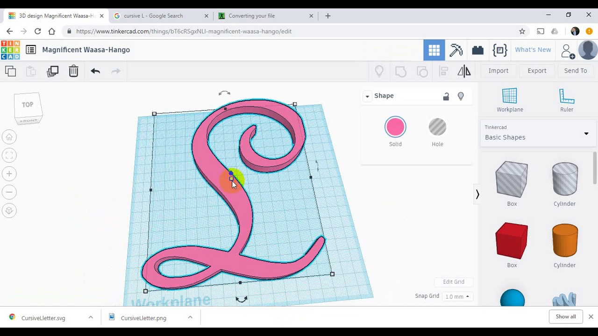

## Step 1. CAD by design
> "design or draw from your imagination and wishes"

### What is this step?

**CAD** stands for **Computer-Aided Design**. This is the starting point for any project. It's where you use computer software to create a 2D or 3D digital model of your idea. Think of it as a high-tech drawing board.

For our CNC machine, we typically start with a 2D "vector" drawing, which is like a digital connect-the-dots outline that the machine can follow.

### Key Vocabulary

* **CAD (Computer-Aided Design):** Using software to create digital drawings or models.
* **Vector (or SVG):** A type of graphic that uses mathematical lines and curves to create an image. This is perfect for CNC because the machine can follow these lines. This is different from a "pixel" image (like a photo or .jpg) which has no clear path for a machine to follow.
* **Export:** Saving your work in a specific file format. We will export our designs to **SVG (Scalable Vector Graphics)**.

### Workflow Steps

1.  **Brainstorm:** Decide what you want to make. A sign? A keychain? A simple box? Start with simple shapes.
2.  **Choose Your Software:** We recommend one of these two free and easy-to-use options:
    * **[Autodesk Tinkercad](https://www.tinkercad.com):** A very simple, free, browser-based tool. While it's known for 3D, you can easily create 2D shapes, text, or export the "bottom" of a 3D design as an SVG.
    * **[Adobe Illustrator](https://www.adobe.com/products/illustrator.html):** A professional tool (available in our lab) that is excellent for creating detailed vector art, text, and logos.
3.  **Create Your Design:**
    * Draw your shapes.
    * Add any text. **Important:** Most CNC software needs text to be "outlined" (converted from a text-font into a shape). In Illustrator, this is `Type > Create Outlines`.
    * Ensure all your lines are "closed" (no gaps).
    * **Video (https://youtu.be/AzG8kJMFDLM?si=agvdSwsEe1r4-umi):** A helpful Youtube video to get started: "Use the Tinkercad SVG Tool to Create Laser & CNC Designs in Minutes!
4.  **Export to SVG:**
    * This is the most important part of this step.
    * Go to `File > Export` and choose **SVG (`.svg`)** as the file type. This `.svg` file is what you will use in the next step (CAM).