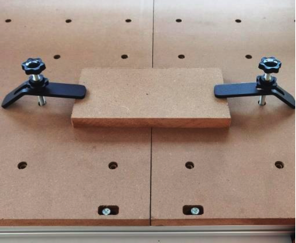
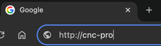

## Step 3. Control the machine
> "send the toolpaths and other machine instructions (GCODE) to the CNC's controller"

### What is this step?

This step is the bridge between the digital file and the physical machine. We use a **G-Code Sender** (also called "control software") to talk to the CNC machine's "brain" (the **controller**).

Our **FoxAlien Masuter Pro** uses a controller that understands G-Code. We will use a program called **Universal Gcode Sender (UGS)** to connect our computer to the CNC via a USB cable, load our `.nc` G-Code file, and tell the machine "Go!"

### Key Vocabulary

* **G-Code Sender:** The software that sends G-Code instructions to the CNC, line by line. We use **UGS**.
* **Controller:** The small "brain" or circuit board on the CNC machine (it runs **GRBL** firmware) that receives the G-Code and controls all the motors.
* **Jog:** Manually moving the machine's X, Y, or Z axis using the software's buttons. This is used to find your starting point.
* **Zero Position (or Origin):** The exact starting point for your job. You set this *every single time*. It's the `X=0, Y=0, Z=0` spot on your material.

### Workflow Steps

---
/// details | **First time? You may also want to follow along with this video.**
    type: note
    
This video is a fantastic guide for all the physical steps of "Step 3: Control the Machine" and "Step 4: CNC the Maker". Watch it carefully. There are some details we will do differently, so also follow along with our Workflow steps below.

<iframe width="560" height="315" src="https://www.youtube.com/embed/6V9tmybmdnY" title="YouTube video player" frameborder="0" allow="accelerometer; autoplay; clipboard-write; encrypted-media; gyroscope; picture-in-picture" allowfullscreen></iframe>

---

 ### Key Steps from the Video

Here is a breakdown of the key tasks you will perform, with timestamps from the video.

* **Methods to hold down your material (1:20)**
    * Your material **must not move** during a carve.
    * The video shows using clamps (3:30) and the "blue tape and CA glue" method.
    * The **blue tape & glue method** is excellent because it holds the material flat from underneath, so the router can't run into a clamp (7:46).

* **Install your bit (11:15)**
    * Make sure the CNC is **unplugged** or the spindle is off.
    * Insert the bit into the collet (the part that grabs the bit).
    * Make sure you push it in far enough, but **do not** let the "flutes" (the cutting edges) go up inside the collet.
    * Tighten the collet nut securely with the wrenches.

* **Installation of your GRBL CNC machine (13:12)**
    * This is the *one-time* step of installing the "drivers" (software) that lets your computer talk to the CNC's controller. This has already been done for you on the CNC-STEAM headless computer the CNC is connected to.

* **Opening UGS software (15:54)**
    * The video shows connecting to UGS (Universal Gcode Sender). This is what we will do in our **[3. Control the machine](control.md)** step, with a few differences with our CNC-STEAM setup.
    
* **Setting the zero position correctly (21:00)**
    * This is the **most critical** step. This video shows two methods:
        1.  **The Paper Method:** Jog the Z-axis down until a piece of paper under the bit *just* starts to get stuck. This is Z=0.
        2.  **A Z-Probe:** This is a small metal block that automates finding the Z=0. This is what we will use.
    * Always remember to **set your X, Y, and Z zero points** before you start!

* **Loading and starting the job (25:41)**
    * Load your G-Code file into UGS and check the visualizer.
    * Put on your safety glasses.
    * Turn on the spindle.
    * Click **Send**.
    * **Do not** walk away. Watch the machine, especially for the first few minutes, to make sure everything is working as expected.
///
---

1.  **Secure your material to the spoilboard by clamp or glue**
    * Your material **must not move** during a carve.
    * 3d printed clamps work well because if the toolhead moves beyond the material, the bit will easily chew up the clamp without breaking.
    * The **blue tape & glue method** is excellent because it holds the material flat from underneath, so the router can't run into a clamp.
    
    
2. **Install your Bit (End Mill)**

	/// admonition | **The Bit is sharper than a knife!**
    	type: warning

	Hold the bit only by the shank and **never by the flute.** The corner end of the flute is even sharper than a knife! A bit is designed to cut through steel like butter.
	///

    * Make sure the CNC is **unplugged** or the spindle is off.
    * Insert the bit into the collet (the part that grabs the bit).
    * Make sure you push it in far enough, but **do not** let the "flutes" (the cutting edges) go up inside the collet.
    * Tighten the collet nut securely with the wrenches.

    

    
3. **Connect to Universal Gcode Sender (UGS)**
	* There are two versions depending if the computer is your own personal or one from HCS managed by TechOps. Choose a workflow edition:

	---       
	/// details | **I am using my own personal computer**
    	type: note
    
	1.  [**Download Software:**](https://universalgcodesender.com/download/) Make sure you 	have **Universal Gcode Sender (UGS)** installed on the computer connected to the CNC. We will use the "Platform" version.
	-- Steps #2 - #4 will be a little different for our CNC-STEAM setup
	2.  **Connect to the CNC:**
	    * Turn on the FoxAlien Masuter Pro.
	    * Connect the computer to the CNC using the USB cable.
	3.  **Launch UGS:** Open the UGS application installed on your computer.

	///
	---
	/// details | **I am using a Hoonah School's computer managed by TechOps**
    	type: note
    
	1.  **Connect to the CNC Machine:** The `CNC-Pro`, `CNC-3S`, or `CNC-mini` box should be connected by USB to the target CNC machine and to a power supply by microUSB. There should be a linking red light inside the box. `CNC-Pro` should be powered ON for 15 seconds before the next step.
	2.  Turn on the CNC machine and wait 10 seconds.
	3.  **Launch CNCjs:** From your computer, type in the URL: [**http://CNC-Pro**](http://CNC-Pro) in the top of Chrome browser window. Do **not** do a Google Search since Google does not know about our CNC machines!!
	
	///
	---
4.  **Establish Connection:**
    * In the "Connection" window, select the correct **Port** for the CNC. (It will usually be the only one that appears when you plug in the machine).
    * Set the **Baud Rate** to `115200` (this is the standard for our machine).
    * Click **"Connect"** (it looks like a plug icon). The status should change to "Online".
    * (optional) Type `$$` into the **Console** and the machine should report report its settings.

5.  **Load G-Code:**
    * Go to `File > Open` and select the `.nc` or `.gcode` file you exported from Easel.
    * **Watch for any machine errors in the Visualizer!** Is the machine doing what we want it to do? Finding machine errors **now** can head off disasters later!

6.  **Set Your Zero (Origin):**
    * This is the **most important** part of machine setup. You must tell the machine exactly where your job starts.
    * Use the "Jog" buttons in UGS to move the machine:
        * Move the X and Y axes until the tip of the bit is directly over the **bottom-left corner** of your material.
        * Click the **"Reset X"** and **"Reset Y"** buttons (or `Set X=0`, `Set Y=0`).
        * Carefully "jog" the Z-axis down until the very tip of the bit is just touching the **top surface** of your material. (The "paper method" is great for this).
        * Click the **"Reset Z"** button (`Set Z=0`).
    * Your machine now knows its `(0, 0, 0)` starting point.

