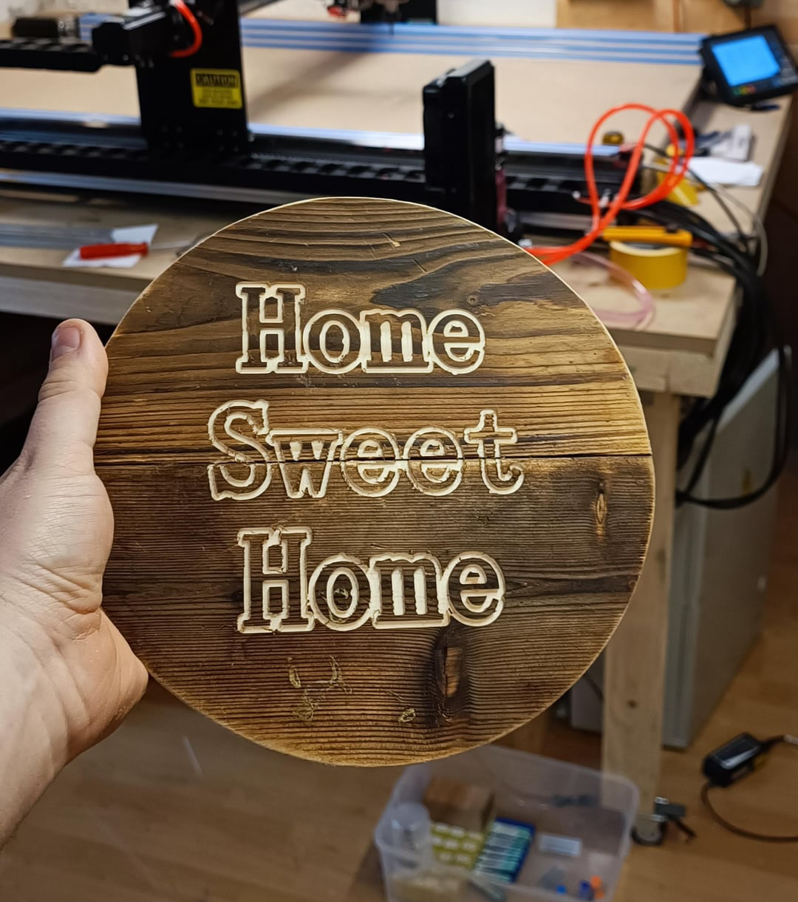
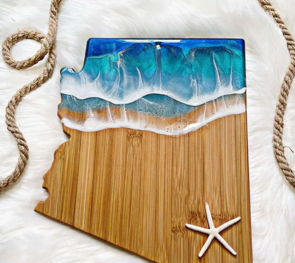

## Step 5. Finishing to Beautify
> "it's the finishing that brings out your project's beauty and more"

### What is this step?

The carving is finished, but we are not done yet! For this step, no CNC machine is needed. Instead, apply your sense of design and aesthetics to beauty to your project.

### Workflow Options

* **Sand** the wood to take off the rough edges left by the CNC and give the whole piece a smooth finish. 

* **Stain** and or **varnish** the wood to give the wood grain life and highlight the engraved design.  

* **Paint** the detail This makes engraving stand out.

* Enhance the carving by filling it with epoxy, adding LED lighting, decorating with trinkets, and much more!

* For multi-part projects, parts will need to be fitted and assembled.

*Further spark your imagination by touring the web for ideas.*

