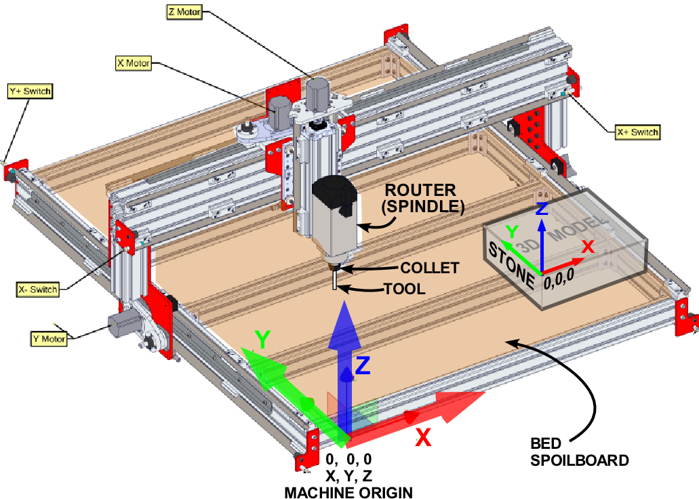
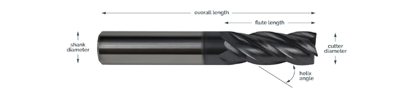

## CNC Glossary of Terms

A quick reference guide to the technical terms used in our CNC-STEAM workflow.

### A-C

**Bit (or End Mill)**
The cutting tool that is inserted into the router. Unlike a drill bit which only cuts down, a CNC bit can cut sideways. They come in many shapes (flat, ball nose, v-bit) and sizes.

**CAD (Computer-Aided Design)**
Software used to create digital drawings or models. In our workflow, this is the "drawing" step where you create the design (using Tinkercad or Illustrator) before you worry about how to cut it.

**CAM (Computer-Aided Manufacturing)**
Software that takes your design and calculates the "toolpaths" for the machine. It figures out how fast to move and where to cut. We use **Easel** for this step.

**CNC (Computer Numerical Control)**
The general term for a machine that is controlled by a computer. It usually refers to the process of using a computer to drive motors that move a tool to shape material.

**Collet**
The steel sleeve that holds the bit inside the spindle/router. It works like a clamp: as you tighten the nut, the collet squeezes the bit to hold it tight.

### D-G

**Down-cut Bit**
A specific type of bit where the spiral blades push the chips *down* into the material. This leaves a very clean top edge, but packs sawdust into the groove.

**Driver**
A small piece of software installed on your computer that allows it to talk to the CNC machine's controller via USB.

**End Mill**
The technical name for a CNC "bit."

**Feed Rate**
The speed at which the machine moves the cutting tool through the material (usually measured in inches per minute or mm/min).

**G-Code**
The programming language the CNC machine understands. It is a text file full of coordinates (like `G1 X10 Y50`) that tells the motors exactly where to go. You don't write this; your CAM software creates it for you.

### H-P

**Jog / Jogging**
Manually moving the CNC machine's axes (X, Y, or Z) using the buttons in the controller software. You "jog" the machine to move it into position to set your Zero point.

**Origin (or Home/Zero)**
The specific point `(0, 0, 0)` where the X, Y, and Z axes meet. You must set this point on your material before every job so the machine knows where to start.

**Pass Depth**
How deep the bit cuts in a single pass. If you need to cut through 1 inch of wood, but your pass depth is 0.1 inches, the machine will make 10 loops to cut all the way through.

### R-T

**Raster vs. Vector**
* **Raster:** An image made of dots/pixels (like a JPG photo). CNC machines struggle with these.
* **Vector:** An image made of mathematical lines and curves (like an SVG). CNC machines love these because they can just follow the line.

**Router / Spindle**
The motor that spins the bit. On our machine, this is the Makita router or the stock spindle provided with the FoxAlien.

**Spoilboard**
The disposable board mounted to the base of the CNC machine. It sits *under* your material so that if you cut all the way through, you damage the cheap spoilboard instead of the metal machine bed.

**SVG (Scalable Vector Graphics)**
The file format we export from our CAD software. It saves the "vectors" (lines) that the CAM software needs.

**Toolpath**
The actual route the machine will take to cut your design. In Easel, you can see these as blue lines in the 3D preview.

**Up-cut Bit**
A bit where the spiral blades pull chips *up* and out of the cut (like a corkscrew). This clears sawdust well but can fray the top edge of your wood.

### U-Z

**UGS (Universal Gcode Sender)**
The software on the computer that acts as the "traffic controller." It connects to the machine, sends the G-Code instructions, and lets you jog the machine.

**Workholding**
The method used to secure your material to the machine bed so it doesn't move. Common methods include clamps, double-sided tape, or the "tape & glue" method.

**X, Y, Z Axes**
The three directions the machine moves:
* **X:** Left and Right.
* **Y:** Forward and Backward.
* **Z:** Up and Down.